---
jupytext:
  text_representation:
    extension: .md
    format_name: myst
kernelspec:
  display_name: ODM Standardized Vocabuary 
  language: python
  name: python3
---

# OMOP CDM and Vocabulary #

## Resources

- [Patient Story](https://www.endometriosis-uk.org/laurens-story)
- [OHDSI Book](https://ohdsi.github.io/TheBookOfOhdsi/StandardizedVocabularies.html)
- [OHDSI CMD slides](https://www.ohdsi.org/wp-content/uploads/2018/10/20181010-OHDSI-Vocabulary-CDM-Tutorial.pdf)
- [OHDSI CDM wiki](https://ohdsi.github.io/CommonDataModel/index.html)
- [OHDSI CDM paper](https://www.sciencedirect.com/science/article/pii/S153204641200069X?via%3Dihub)
- [OHDSI github](https://github.com/OHDSI/CommonDataModel)

## Tools
- [Query Library](https://data.ohdsi.org/QueryLibrary/)
- [Query Library wiki](https://github.com/EHDEN/QueryLibrary)


## Vocabulary ##

### Disease Hierarchy ##
> **Important when building cohort of people**
- A concept has **descendants (more specific)** and **ancestors (more general)**
- ICD does not represent the true nature of disease
    - disease cannot be represented by a flat file
- ICD is useful for
    - statistics
    - billing purposes
    - administrative purposes
- SNOMED does the perfect representation of disease heirarchy
    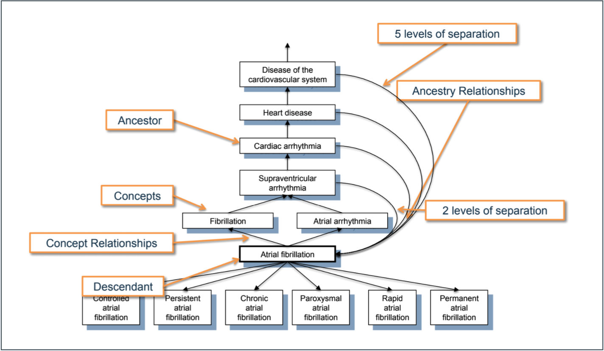
    - a ICD10 diagnosis of `Atrial fibrillation` also means diagnosis of 
        - Atrial Arrythmia
        - Supraventricular Arrythmia
        - Cardiac Arrythmia
        - ...
        - Disease of the cardiovascular system
        
### OMOP Relationship ###
- concept_relationship
    - `is a` - pointing up
    - `subsumes` - pointing down
- **getting heirarchy for a concept of a condition**
    ```sql
    SELECT max_levels_of_separation, concept_id, concept_name
    FROM concept_ancestor
    JOIN concept
        ON ancestor_concept_id = concept_id
            WHERE descendant_concept_id = 313217 --Atrial fibrillation
            -- WHERE descendant_concept_id = 44784217 -- Cardiac Arrythmia
                ORDER BY max_levels_of_separation
                
    ```
- **getting concept_relationship and concept_name**
    ```sql
    SELECT cr.*, c.concept_name, c.standard_concept, c.vocabulary_id
        FROM `learnclinicaldatascience.mimic3_demo_omop.concept_relationship` cr
        JOIN `learnclinicaldatascience.mimic3_demo_omop.concept` c
            ON cr.concept_id_2 = c.concept_id
        WHERE cr.concept_id_1 = 44825429
    ```
- **getting associated drugs with specific ingredients using descendants**
    ```sql
    SELECT 
    COUNT(DISTINCT(de.person_id))
    FROM `learnclinicaldatascience.mimic3_demo_omop.drug_exposure` de
    WHERE de.drug_concept_id IN (
        SELECT ca.descendant_concept_id
        FROM `learnclinicaldatascience.mimic3_demo_omop.concept_ancestor` ca
        WHERE ca.ancestor_concept_id = 1310149 --warfarin
    )
    ```
- **getting associated drugs with medication class using descendants**
    ```sql
    SELECT 
    COUNT(DISTINCT(de.person_id))
    FROM `learnclinicaldatascience.mimic3_demo_omop.drug_exposure` de
    WHERE de.drug_concept_id IN (
        SELECT ca.descendant_concept_id
        FROM `learnclinicaldatascience.mimic3_demo_omop.concept_ancestor` ca
        WHERE ca.ancestor_concept_id = 4283987 --ANTICOAGULANTS (VA CLASS)
    ```

### Drug Hierarchy ###
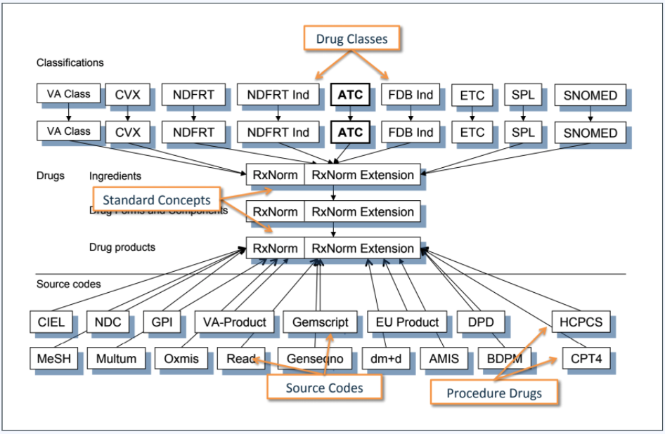

### Vocabulary ERD ###
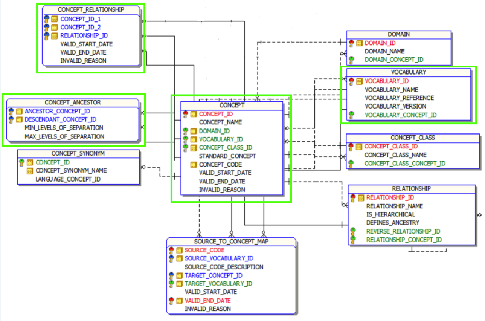

### Concept Relationship Table ####
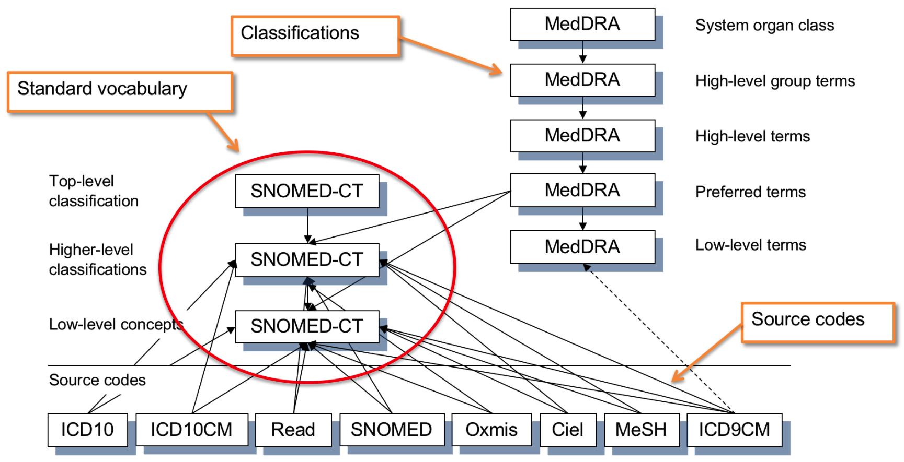


## OMOP CDM principles ###
1. patient centric
    - individual is storing information
    - not summary level data
1. vocabulary and data model are blended
1. domain-oriented
1. accommodates data from various sources
    - data registries
    - emr
    - surveys
1. preserves data provenance
    - provenance: avoiding to lose raw data
1. extendable and evolving
1. database platform independent 

## OMOP CDM Role ##
The CDM is designed to support the conduct of research 
1. identify and evaluate **associations between interventions** from:
    - drug exposure
    - procedures
    - healthcare policy changes 
1. identify **outcomes caused by these interventions** (condition, procedure, drug exposure)
    - outcomes can be 
        - efficacious (benefit) 
        - adverse (safety risk)
1. identify **specific patient cohorts** ay be defined for treatments or outcomes
    - e.g., those taking a certain drug or suffering from a certain disease
    - using clinical events (diagnoses, observations, procedures, etc.) that occur in predefined temporal relationships to each other
1. support the generation of **reliable scientific evidence** about:
    - disease natural history
    - healthcare delivery
    - effects of medical interventions
    - the identification of demographic information
    - health care interventions 
    - health outcomes.

## OMOP Table that requires pre-population ##
- PERSON
- OBSERVATION_PERIOD
- CONCEPT
- VOCABULARY
- DOMAIN
- CONCEPT_CLASS
- CONCEPT_RELATIONSHIP
- RELATIONSHIP
- CONCEPT_SYNONYM
- CONCEPT_ANCESTOR
- DRUG_STRENGTH

## OMOP CDM Principles ###
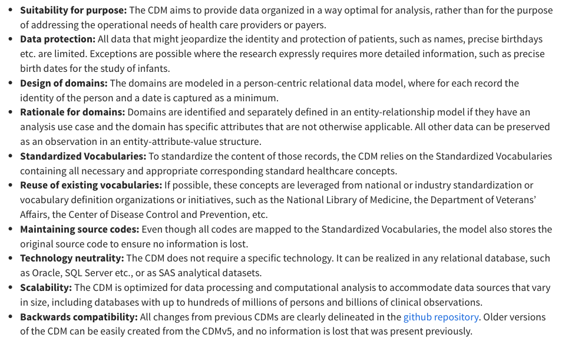

### Condition ###


### Drug Exposure ###


### Drug Era ###


### Measurement ###
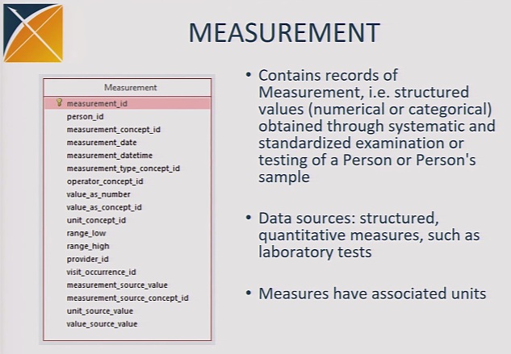

### Observation ###
> **observation periods define the spans of time a person is eligible to have recorded clinical observations, but does not require that one or more observations are actually observed**

> **OBSERVATION_PERIOD table contains records which uniquely define the spans of time for which a Person is at-risk to have clinical events recorded within the source systems, even if no events in fact are recorded (healthy patient with no healthcare interactions).**

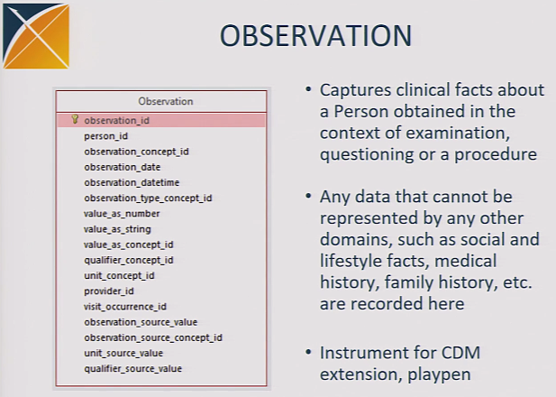

### Person ###
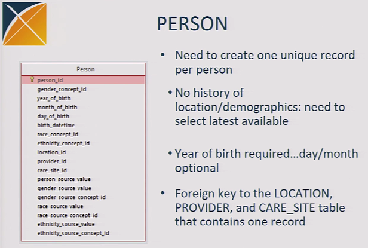

### Occurence ###
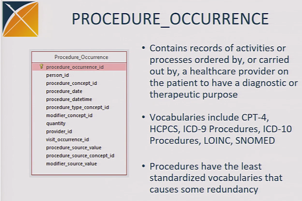

### Procedure Occurence ###
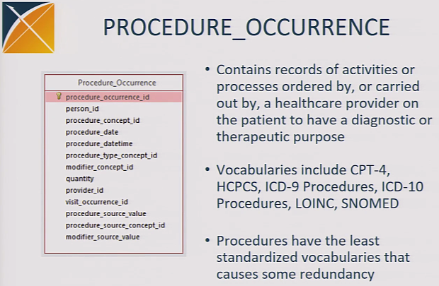

### Visit ###
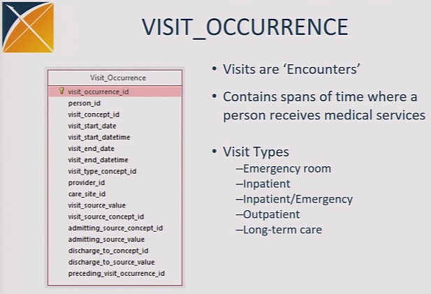
