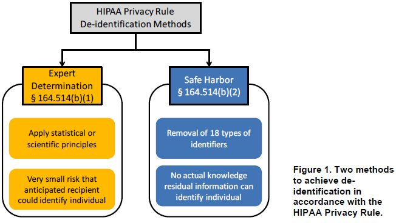
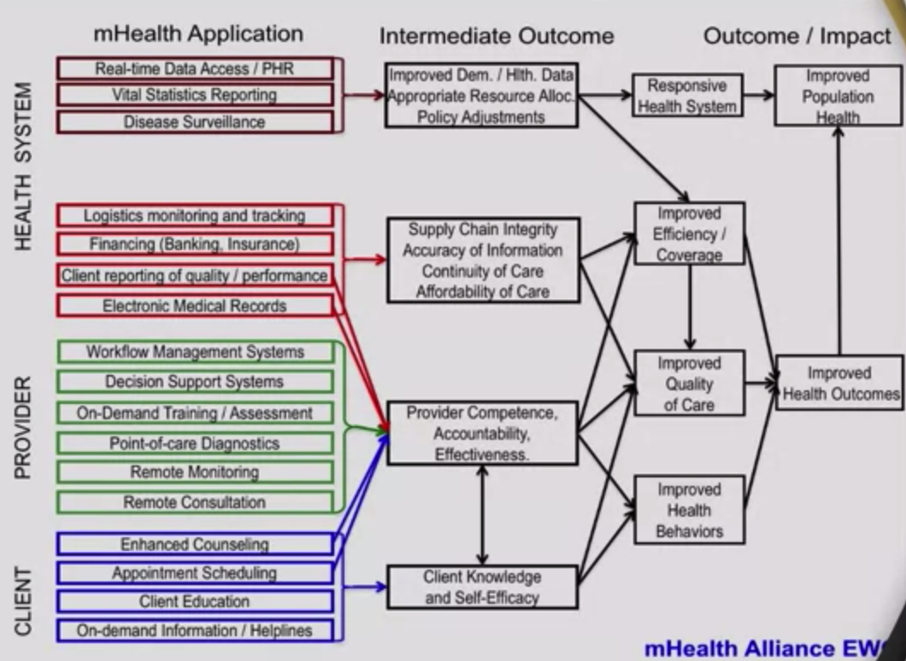

---
jupytext:
  text_representation:
    extension: .md
    format_name: myst
kernelspec:
  display_name: Data Management for Clinical Research 
  language: python
  name: python3
---

# Data Managemet for Clinical Research #
## Resources
- Paper
    - [Preparing raw clinical data for publication: guidance for journal editors, authors, and peer reviewers](https://www.bmj.com/content/340/bmj.c181)
    
## Week 5 - Posts-Study Activities

### Wrapping Up
1. Study Close-out Procedures 
    - prepare at the inception
    - no longer folowing up study subjects
    - no further work done
    - type of Study Close-out
        1. Scheduled
            - completed at xpected time
        1. Unscheduled
            - safety or validty concerns
            - interim results inconclusive
            - interim results are overwhelmingly positive
            - funding dries up
            - competing research is published
            - disasters
            - key personnel leave and cannot be replaced
    - Data Management for Close-out
        - keep checklist of data procedures
        - make sure all data are entered in database
        - run quality checks on data and query any erros
        - resolve all open data issues
        - forms are collected, completed and legible
        - lock the database
        - implement record retention
1. Record Retention and data Archival
    - What to keep
        - documents, electronic and paper
        - frozen versions of dataset
        - analysis scripts used in reports/publication
        - hardware/software required to read data
        - backups of files
    - How long to keep
        - varies to according to
            1. Good Clinical Practice
                - at least `2-3 years` 
            1. US Office for Human Research Protections
                - at least `3 years` 
            1. US FDA
            1. EudraLex (EU)
                - at least `5 years` 
            1. IRB
            1. Trial sponsor
            1. Institution
1. Data Destruction
    - authority sign-off
    - docment details of data destroyed
    - achive teh record destruction log
    - use confidential paper recycling service
    
### De-identifying Data
- **HIPAA methods**
    1. Expert Determination
    1. Safe Harbor Method
    
- **REDCap De-identifying methods**
    1. Known identifiers
        1. removal of known identifiers
        1. hashing the person identfier
    1. Free-form text
        1. removal of unvalidated text fields (text fields other than dates, numbers)
        1. removal of notes/essay box fields
    1. Date and datetime fields 
        1. removal of all date and datetime fields
        1. shifting of dates
- **Common De-identifying Techniques**
    1. Dates
        1. keeping year only
        1. shift dates by random intervals 
            - Steps of **Date Shifting Method**
                1. for each record, choose a random integer between 0 to 365
                   - use days in a year as intervals
                1. shift all dates in that record accordingly
                1. keep the date shifting keys (i.e. "secret key") or lookup table
                1. separate the process for ages 89 and above
            - `note`
                - doesn't require adding new types of variables to dataset and codebook
                - year only are excluded in HIPAA definition of date identifier
                - age 89 years - all elements (i.e. yyyy-mm-dd) are date identfier
                    - rationale: easier to identify fewer people 
                    - solution: group together as `90 and above`
        1. report time intervals
            - Steps of **Time Interval Method**
                1. choose and event to serve as baseline events
                    - e.g. study enrolment date
                1. for each record, calculate the numbers of days from baseline date to every other event date
                1. report these date intervals instead of actual dates
                1. paird dates can be converted to durations
                    - e.g. hospital admission date + discharge date == hospital duration stay
        1. report age at event
            - Steps of **Age at Event Method**
                1. calculate subjects exact age at each event
                1. report year of enrollment
                1. the dataset will only have eact age and year of enrolment, no dates

### Healthcare Information System Categories
- Categories
    1. General Administration
    1. Research Administration
    1. Clinical Operations
    1. Clinical Care
    1. Ancilliary Clinical
    1. Departmental
    1. Data Aggregation
    
    
### Imaging Data
1. Picture Archive and Communication System (PACS)
1. Digital Imaging Communications in Medicine (DICOM)
    - ISO 12052:2006
    
### mHealth 
1. Categories of mHealth
    - 
1. Considerations
    1. Security and Privacy
    1. Evidence of impact of mHealth Solution
    1. Scalability
    1. Interoperability
        - health information exchange
        - reporting to government
        - cross-cutting
    1. Cost, Payer vs Beneficiary
    1. Policy and Ethical considerations
    
### Data Management for Multi-center or Network based Studies
1. Team Roles 
    - Delegation Class
        1. Study Site
            - enrolling patient
            - gathtering data
        1. Operational Coordinating Center
            - Study Operations
        1. Data Coordinating Center
            - Managing Collection
            - Storage
            - Quality
            - Cleaning
            - Dissemination
1. Responsiblities
    - multiple instutitions
        - multiple IRB
        - multiple contracts/subcontracts
        - data use agreements
        - business associate agreements
        - certification of GCP
        - certification of Training
    - multiple site investigators 
        - data ownership
        - publication policies
        - scientific credit
        - sites
1. Logistics
    - randominization of subjects across centers
    - assignment of IDs (across sites) 
    - equipment and support
    - centralized training
    - user management and roles
    - data hosting and harmonization
        1. centralized 
            - pro: easy decision for trials
            - cons: 
                - difficult for pilot collaborations
                - giving up control of data
        1. decentralized
            - important use of single standard 
            - standardization of forms 
            - any versioning should propagate on multiple sites
1. Monitoring         
   - Monitoring Study Progress
   - Monitoring Data Completeness
   - MOnitoring Data QUality (Query Issuance and Resolution)
1. Data Quality
    - Freeze
    - Clean
    - De-identified
    - Disseminate for analysis/publication
   
   
1. Team Roles 
    - Delegation Class
        1. Study Site
            - enrolling patient
            - gathtering data
        1. Operational Coordinating Center
            - Study Operations
        1. Data Coordinating Center
            - Managing Collection
            - Storage
            - Quality
            - Cleaning
            - Dissemination
1. Responsiblities
    - multiple instutitions
        - multiple IRB
        - multiple contracts/subcontracts
        - data use agreements
        - business associate agreements
        - certification of GCP
        - certification of Training
    - multiple site investigators 
        - data ownership
        - publication policies
        - scientific credit
        - sites
1. Logistics
    - randominization of subjects across centers
    - assignment of IDs (across sites) 
    - equipment and support
    - centralized training
    - user management and roles
    - data hosting and harmonization
        1. centralized 
            - pro: easy decision for trials
            - cons: 
                - difficult for pilot collaborations
                - giving up control of data
        1. decentralized
            - important use of single standard 
            - standardization of forms 
            - any versioning should propagate on multiple sites
1. Monitoring         
   - Monitoring Study Progress
   - Monitoring Data Completeness
   - MOnitoring Data QUality (Query Issuance and Resolution)
1. Data Quality
    - Freeze
    - Clean
    - De-identified
    - Disseminate for analysis/publication
   
   
### Considerations for Resource-Limited Settings and Global Health
1. Understanding Settings
    - electricity, voltage flactuation can damage:
        - electrical equipment
    - internet availability can affect:
        - data entry
        - data sharing and reporting
        - training and meeting
        - monitoring
    - data environments
        - security
        - climate control
        - connectivity
    - shipping service
    - phone service
    - service may be
        - intermittent
        - slow
        - unreliable
        - not available
    - regulations
        - data privacy
        - data security
        - IRB
    - perssonnel
        - computer literacy
        - training
        - retention
    - language
    - timezones
    - attitude towards research
1. Rethink Data Collection Modalities
    - acquisition of equipment
    - powering of equipment
    - maintenance and repairs
    - sharing the data
    - training
    - appearance of wealth
    - local understanding and acceptance of technology
1. Redesigning Data Collection Forms
    - contextualize the environment
    - mother's name
        - as unqiue identifier
        
### Challenges of Collecting Data in Resource-Constrainted Settings 
1. Physical Challenges
    1. Electricty
        - power surges
        - frequent power outages and rolling blackouts
    1. Internet Access
        - intermittent and small bandwidth
    1. Geographical separation
    1. Building Infrastructure
1. Communication
    1. Language Barriers
        1. translation difficulties
            - use native speakers as data collectors
        1. lost in Translation
            - e.g. some countries don't have zipcode
1. Cultural Differences
    1. Collaborating (Personal Interaction)
    1. Planning
1. Educational Challenges
    1. Low Literacy Rates
    1. Research Training
        - qualified research partners
1. Data Quality
    1. In-person data audits
        - review of paper chart vs electronic records
1. Additional Recommendations

### Data Privacy and Data Use Agreement 
1. Privacy of data source
1. Ethics in sharing clinical data
1. Data use agreements (DUAs) or Data Transfer Aggrement or Data Access Aggreement
    - Elements
        1. description of the study
        1. description of scope of data use 
            - for single or multiple project
            - state who shared to be with anyone else
            - state procedures of termination
        1. statement of data ownership before, after completion of the project
            - state who owns the data
            - state what happents to data after study completion
        1. description of rights and obligations of parties in the agreement
    