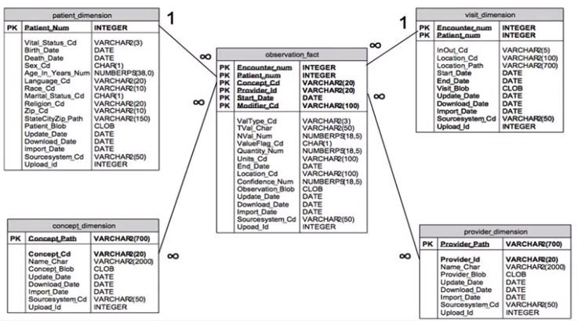
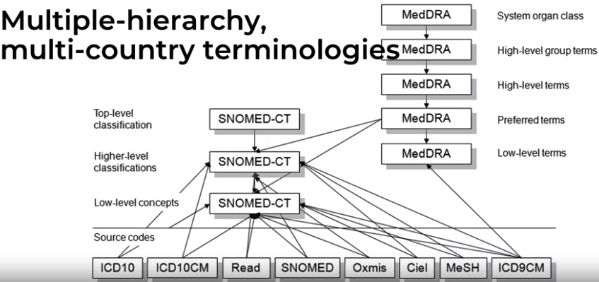
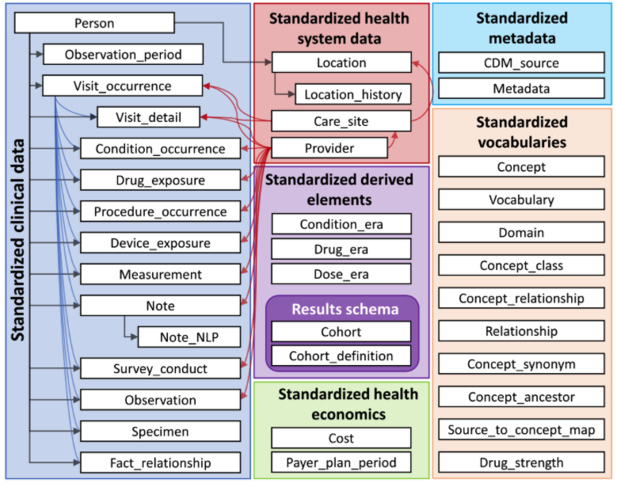
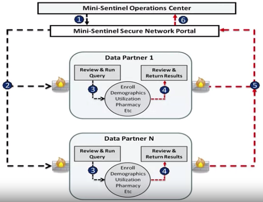
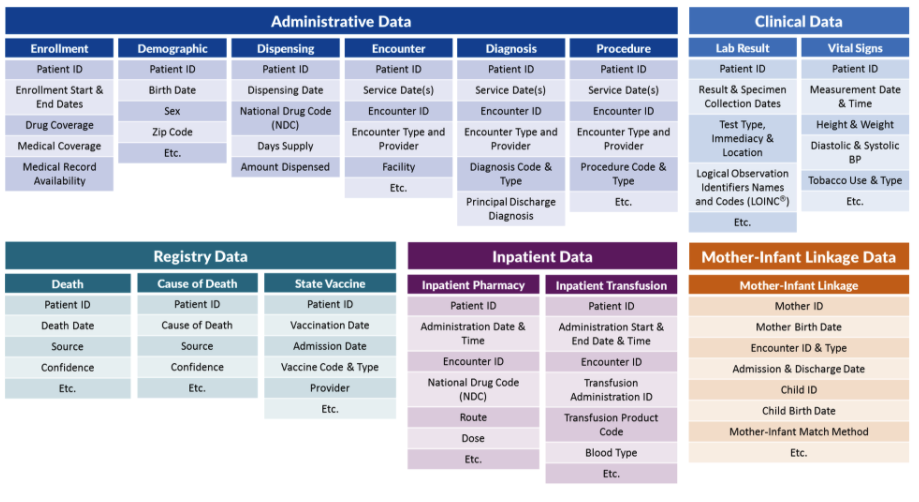
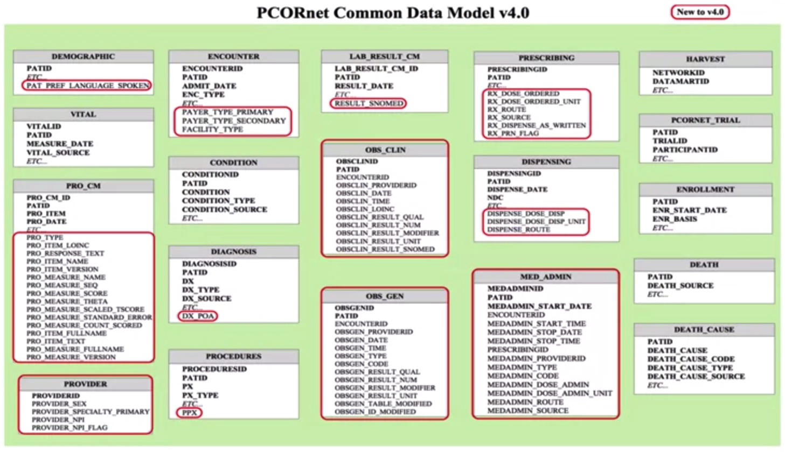
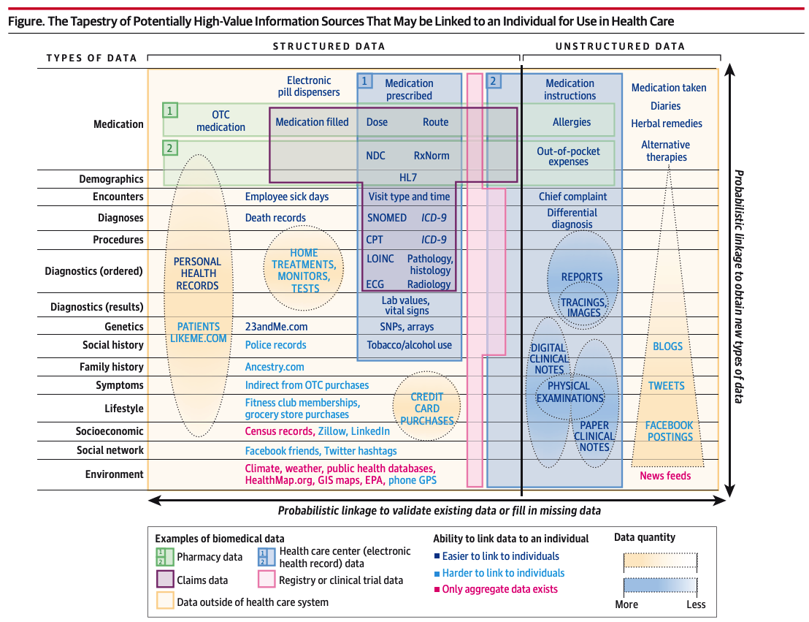
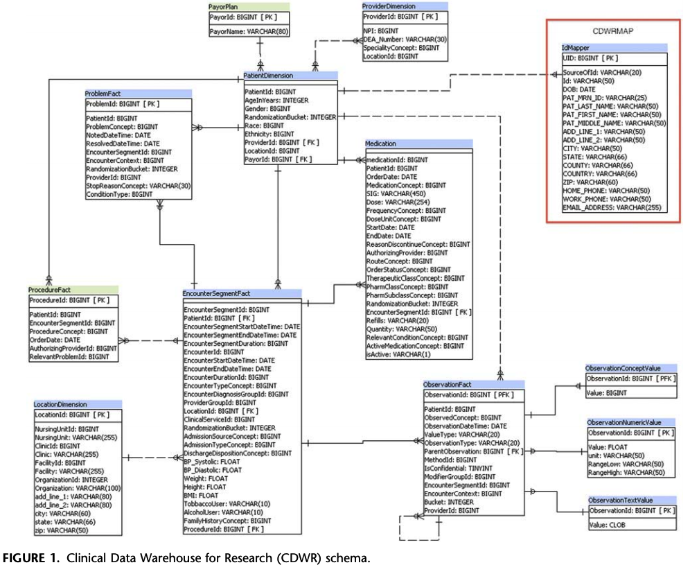

---
jupytext:
  text_representation:
    extension: .md
    format_name: myst
kernelspec:
  display_name: Clinical Data Models
  language: python
  name: python3
---

# Clinical Data Models #

## Week 1 - Introduction 
### Common Data Model
- Definition
    - specifies the single location , specific table and column name, allowed values for each data element
    - tailored to be specific to the clinical problem that data partner networks is trying to study (i.e. Disease specific network)
- Benefits
    1. Reduces reformat of different output
    1. Ability to include more data partners to participate in a data request
    1. Ensures same query logic that is applied to all data partners
    
### Open Source Research Commond Data Model
1. i2b2 (Informatics for integrating Biology & the Bedside) 
1. OMOP - OHDSI Consortium
1. Sentinel - USA FDA
1. PCORnet - Patient Centered Outcomes Research Institute

#### i2b2 (Informatics for integrating Biology & the Bedside) 
- Harvard, non-profit
- derived from existing Research Patient Data Registry ((RPDR)
- focus on finding patient eligible to enrol in clinical trials
- included biomarker, genomics, and clinical data
- with > 300 user institutions 
- Data Model + Application
- `Folder` based terminiologies/queries
- Schema
 
 
#### OMOP 
- (OMOP) Observational Medical Outocmes Partnership 
- (OHDSI) Observational Health Data Science and Informatics 
- drug surveillance/adverse event detection
- started by US FDA and moved to OHDSI for broad clinical research or `evidence generation`
    - Columbia University
- strong international oreintiation
     
- most focuseds on analytics
- Data Model (CDM version6 )
 
 
#### Sentinel 
- funded by US FDA and managed by Harvard ,USA only
- features
    - no GUI, but uses distributed query system called `PopMedNet` 
    - uses SASS or SQL Scripts
    - `relational data model`
- workflow
    - data partners can look at a query before executing it on their data
    - data partners can decline to execute query
    - data partners can look at the results before sending it to the requestor
- query process
     
- strict local control
    - strong data model governance
- main users
    - FDA CDER (Center Drug Evaluation and Research)
    - FDA CBER (Center for Biologics Evaluation and Research)
- integrates `billing` and `clinical` data
- focus on rapid adverse drug event detection
- Schema 
 

#### PCORNet 
- (PCORNet) Patient Centered Outocme Research Institute
- features
    - leveraged much of its design form `Mini-Sentinel` project
    - uses SASS or SQL Scripts
    - `relational data model`
    - uses distributed query system 
        - data stays in local institution
        - query executed locally
        - SQL sent to institution
        - summary results sent to central location
- workflow
    - similar to sentinel
        - uses the same distributed query platform
        - additional model to existing sentinel data model
        - same data governance principle of sharing summary results only
- most complex data network composed of
    - Clinical Data Research Networks (CDRNs) 
        - by large healthcare institutions
    - Patient-Powered Research Networks (PPRNs) 
        - by disease-specific registries
    - Health Plans Research Networks (HPRNs) 
        - insurance
- user community is much broader and diverse than is Sentinel, which effectively exists only to serve the FDA
- Schema 
 

### Different Sources of Biomedical Data
 
 
### OpenMRS Schema 
 
 
### [Clinical Data Warehouse for Research](https://d3c33hcgiwev3.cloudfront.net/VOZjwArJEemP8Qpm209XvA_551897500ac911e9be2dd9993e1c644d_Identifying-Appropriate-Reference-Data-Models-for-.9.pdf?Expires=1601683200&Signature=RoC6YBZ1QnB2CfSC3prcxVTS9V0hYjtvrIb32iYp5m3Tsq8bs7qQmX8VGDocuJvxkDF6ygHpnM48zuLfFYcSH7ujjWTuMvcmNNRS-ROlC8CuZKyNfT4PThvDwCCGL0bM5~GCqAiZ~3XpClF9gY5X4P0GD4ceuw1NWVWeejd-2gQ_&Key-Pair-Id=APKAJLTNE6QMUY6HBC5A)
 

### MIMIC-III Schema 
 

## Week 2 - Tools: Querying Clinical Data Model

### MIMIC-III DEEP DIVE
- MiMIC - Medical Information Marked for Intensive Care
    - 11 year time frame (2001-2012)
    - subset free access (100 patients only)
    - data achiving method
        1. de-identification
        1. date shifting
            - original dates changed to future dates
        1. format conversion 

- Dataflow
     
- Schema
    
    
### OMOP DEEP DIVE
- Mission: Collaborative community and evidence-driven
- Vision: Observational research for understanding of health/disease
- Conceptual view of OMOP MODEL
    - 2 models
        1. Local (source)
        1. Network (standard)
- OMOP Computed Abstractions
    1. Observation Period
        - duration of patient under the care of provider or health plan
    1. Drug Era
        - drug exposures
    1. Condition Era
    1. Cohort
        - a group of patient with common set of characteristics
        
        
### OMOP vs MIMIC-III

| MIMIC | OMOP |
| --- | --- |
| Store diverse data and retain original format | Considers International data sharing from inception |
| single institution | international harmonization of terminology |
| maintains differences in underlying source data system | keeps original data but doesn't use it |
| ICU and Admission-centric | Wide-range of care environments
| data source are stored in sepearate tables (CareView vs MetaView System) | data from different sources combined into one table (medications from presribed, filled, administered tables are combined into drug_exposure table) |
| no computed abstractions | lots of computed abstractions | 
| Flat termininology structure | hierarchial sets | 
| optimize for data integrity | optimize to support multi-international institutions |
| transformation seeks zero information loss | transformation may lose data fidelity |
| harmonizatino done by data analyst | harmonization done by local data owners |

## Week 3 -  Extract-Transform-Load and Terminology Mapping 
### Structural versus Terminology Mapping
1. Structural Mapping a.k.a `Syntactic Mapping`
    - ERD redesigning to accommodate other fields
    - Dats Model Transformation
        - relational to star-schema
        - relational to object oriented model
        - document based to relational models
    - mainly involves
        - sql joins
        - data ypes
1. Structural Mapping a.k.a `Semantic Mapping`
    - mainly involves
        - formats
            - date to string
            - number to string
            - etc..
        - missing values
            - null 
            - yes/no flags
        - valuesets
            - ICD10 to SNOMED Codes
            - Male to "M"
            - pre-coordination vs post-coordination
                - "Hypertension with renal disease" vs "hypertension; Renal Disease"
             
             
### Components of ETL
1. Data Profiling
    - understanding the raw and native data statistics
1. Data Mapping
    - moving data from source to destination model/table
1. Terminology mapping
    - conversion of terms for conformity to CDM

### Data Profiling with `White Rabbit`
- understand the source data
    - what are the values present
    - how often are used
- `note`: medical data are usually `long-tailed`
    - few terms are use frequently and more terms are less used
    
### Data Mapping with `Rabbit in a Hat` ETL Tool
- information loss
    - when there is no target term/column to map the source column

## Week 4 - Data Quality Assessments

## I. Components of Data Quality
### 1. Data Quality Dimensions
- measures the data quality features
- case to case basis
- example
    - completeness, conformance, etc..

### 2. Data Quality Measures 
- usually summary measures
- are grouped into data quality dimension
- may appear in multiple data quality dimensions
- example
    - mean, median, min, max, etc..

### 3. Data Quality Rules 
- measures the thresholds of acceptability
- use case or business objective independent
- requires expert knowledge or literature benchmark
- can provide insights to potential data quality issues
- rules trigger based on data quality measures
- pre-specified limits
    - warnings
    - red flags
    - hard stop rules
- Global Rules
    - high level overview
- Use-case Specific Rules
    - use-case specific 
- Sample DQ Rules
    1. FDA Sentinel Project
        - numeric warning for laboratory test names
    1. OMOP Achilles DQ Tool
        - number of duplicate condition occurence concepts per person
    1. Pediatric Health Information System (PHIS)
        - CPT codes encoded are invalid for >= 2% of cases or >= 25 cases
- Types of Sample Rules
    1. plausibility atemporal
    1. conformance value
    1. completeness
    1. conformance relational
    1. plausibility temporal
    
  
## II. Other Qualifier of Data Quality
### Instrinsic Data Quality
- Overall quality of data without any reference to specific use of the data
- General sense of data quality that could reveal sufficient issues to deem a dataset unusable or usable
- High level overview of key strenghts/weakenesses of the data
- DQ measures and rules that are independent of any specific use
- example
    - missing laboratory data must not exceed 20%
    
### Fitness for Use
- DQ measures and rules designed for a specific use case
- example

## III. Sources of Data Quality Issues
- arises in all stages of data lifecycle
    1. Entry
    1. Storage
    1. Management
    1. Extraction
    1. Analytic Computation
    1. Reporting and Display
- different common types of data quality problems
    1. missing data
    1. entity outliers
    1. no matching concept
    1. past event
    1. inconsistent null distributions
    1. post-death fact
    1. temporal (overall amount of data) outlier
    1. unexpected flactuation in records
    1. pre-birth fact
    1. future event
    1. numerical outliers
    1. missing expected concepts
    
## IV. Tools for Data Quality Assessment 
### 1. `White Rabbit` 
- assess the following
    1. Data model conformance (data types)
    1. Completeness/Missingness
    1. Atemporal density
    
### 2. Raw `SQL` 
- assess the following
    1. Distribution
        - Continuous (numeric)
            - mean, median, mode
        - Categorical
            - histogram
    1. Temporal Density
    
### 3. ODHSI `ACHILLES` tools 
- Toolkit
    1. ACHILLES (data quality measures)
        - large library of precomputed data quality measures in `r` script
    1. ACHILLES Heel (data rules) 
        - DQ rules for alerts an warnings across all tables and models also in `r` script
    1. ACHILLES WEB (data visualization)
        - incorporated into ATLAS

## V. Data Quality Rules
    
## Terminology
1. Atemporal 
    - do values, distributions, or densities agree with expected values 
    - example, is the prevalence of diabetes implied by the data in line with the known prevalence?
1. Temporal 
    - are changes in value in line with the expectation?
    - example, are immunization sequences in line with recommendations? 

## Week 5 - Practical Application 
## I. High Level ETL Process 
### 1. Extract
- data exporting
- data validation

### 2. Transform
- data cleansing
- data manipulation

### 3. Load
- data loading
- data quality checking

## II. ETL Process 
### Step 1. Understand source and target models
- ERDs, data dictionaries 
- DML, DDL
- table and column definitions

### Step 2. Profile source data tables
- access intrinsic data quality 

### Step 3. Create ETL Mapping
- structural and semantic mappings

### Step 4. Write transformation code
- work down list list of source and target tables

### Step 5. Executing the transformations to create target table(s)
- SQL-centric or programming langauge-centric

### Step 6. Data Quality Assessment
- pre-transformatino vs post-transformation

### Step 7. Documentation
- What was done
- decision/assumptions made
- edge cases/unusual situations
- `Other` documentation
    - Data quality findings
    - assumptions/short cuts/known issues
    - Conventions used to
        - Process bad data
            - missing data
            - out-of-range
            - wrong format
        - Termininology mapping decisions
            - inexact match

## Resources
### Week 1 - Introduction 
- Papers
    - [Common Data Models (CDMs) to Enhance International Big Data Analytics: A Diabetes Use Case to Compare Three CDMs](https://d3c33hcgiwev3.cloudfront.net/cT5eWgAFEemAgQrXx6bp4g_7166f4c0000511e99b75572b09ecdbb4_Harshana-et-al.---2018---Common-Data-Models-_CDMs_-to-Enhance-International.pdf?Expires=1602288000&Signature=ZQUF0rcpDbDcLYDRzGC8KmvwzBUfce0wZCbFCl04MU9vfnUeLWh8BcJQHW4B1NeGpFjCaY1wJ772X~AtChmAKkSjW96KYXkvqLGN-7uiDrEEQgK5PXSa8ymdXPQtlePoELGWuRxE47qMieanZS8uwG~NMXO8ZSa9r8KPB2p-j7M_&Key-Pair-Id=APKAJLTNE6QMUY6HBC5A) 

    - [Serving the enterprise and beyond with informatics
    for integrating biology and the bedside (i2b2)](https://d3c33hcgiwev3.cloudfront.net/cUBaKwAFEemAgQrXx6bp4g_7165bc40000511e9ac516f5d6962b7b8_Murphy-et-al.---2010---Serving-the-enterprise-and-beyond-with-informatics.pdf?Expires=1602288000&Signature=UU1qip7NLwqXK-oWN1dqxKGo-GJCxqxeVxlwboeEhbsmClL51tIIYWMwaO7IZzhjBsw9v2mSIVfZF2a~YDDQ1uZtfX1AqyiR6nxiGWTHWaw2EifJPmIerySleBe08GA~iEZ~aS3aMNHE2OfaekoE0fyyn851nmMFU9fDcFm6xTA_&Key-Pair-Id=APKAJLTNE6QMUY6HBC5A)
    
    - [Data Model Considerations for Clinical
Effectiveness Researchers](https://d3c33hcgiwev3.cloudfront.net/cRTRhwrHEemYdRIT0BhLtg_714afbe00ac711e980d6e7465a739109_Kahn---2012---Medical-Care.pdf?Expires=1602288000&Signature=T2FHJaprnAgz7Lv5XQF1HZ4OSbzQS4IfIZsyasnPPBSmMg4LqBZR36Fq9SuSpnPfUqdBAjuzSeG9485IDTu0CEdaMge5~As0ZwKVrxtmdTgeOztKnMSAcDTGL68SnnwHFdbapDg0D6VEPnYdcGwlUQJaeRcSRMeIKcOgXIK4a6M_&Key-Pair-Id=APKAJLTNE6QMUY6HBC5A)
    
    - [Identifying Appropriate Reference Data Models for
Comparative Effectiveness Research (CER) Studies Based
on Data from Clinical Information Systems](https://d3c33hcgiwev3.cloudfront.net/VOZjwArJEemP8Qpm209XvA_551897500ac911e9be2dd9993e1c644d_Identifying-Appropriate-Reference-Data-Models-for-.9.pdf?Expires=1602288000&Signature=h5Mzh-MJKtCVYIFQbUvLe2TK4Ycve9XcNHYMJHK3ObKavANbMNMWNF0utlckWlRHoYAj42ZJdqL80SOfgG409VTm7XXiFlECbxxkRi3K1zUF4cm4ob3G6Jvb7TlTJ20ZvzlX34HM4aF90OtyK1i-F0VN8tC1qi1~zZ4UhYfHVp4_&Key-Pair-Id=APKAJLTNE6QMUY6HBC5A)

- [MIMIC IV Website](https://mimic-iv.mit.edu/)
- [MIMIC III Website](https://mimic.physionet.org/)
- [MIMIC III Schema Official](https://mit-lcp.github.io/mimic-schema-spy/relationships.html)
- [MIMIC III Schema](https://cloud.githubusercontent.com/assets/26095093/23737659/454872b0-0449-11e7-987d-639b0415dca4.png)

- [MIMIC III Repository](https://github.com/MIT-lcp/mimic-code)
- [Finding the Missing Link for Big Biomedical Data](http://citeseerx.ist.psu.edu/viewdoc/download?doi=10.1.1.452.9557&rep=rep1&type=pdf)

### Week 2 - Tools: Querying Clinical Data Model
- [MIMIC-III Overview](https://d3c33hcgiwev3.cloudfront.net/BPhv1ArLEem6Pgo4-YwqLg_052af1500acb11e980d6e7465a739109_Data-Descriptor-MIMIC-III_-a-freely-accessible-critical-care-database.pdf?Expires=1602028800&Signature=M48DqhjyhvMWdteVnNlufTVbh~oOgTS10SJT3i33ua4jyCLLUAt2ZoCB7MrsaOqXFkS1ViZqgRS-qHkeBqPBSPP~bFfdxs9l16edjlvZcz7pHgXH4Sk1SW4kYpifbIW3x9qmGJxm2TvdyB-smMalOVNJZnsXusZhbRTuegkPzAg_&Key-Pair-Id=APKAJLTNE6QMUY6HBC5A)

- [MIMIC-III Bigquery SQL Scripts](https://d3c33hcgiwev3.cloudfront.net/5iLW3wAFEemTKQ5ajE7PqA_e62f8060000511e9abba8fe04eb746ff_Module-2-SQL-statements.sql?Expires=1602028800&Signature=ShGVnuLTAO6qy0-127yr1zmfoYrBA1LpmQOSLOUaH3doXkDRYnEatGL~Y4xjj0y4Kwef2q0bMX7GEIKHzg5v2iXZ1GjbG5wgVQKkKmpYdFFHotcrxEaRebC6ZPFlweGxpbxO9XPAIdbl9QWA6nAqxDHb1EMty~vm3wb1biA2nS8_&Key-Pair-Id=APKAJLTNE6QMUY6HBC5A)

- [OHDSI.org](https://ohdsi.org/)

### Week 3 -  Extract-Transform-Load and Terminology Mapping 
- [ETL Framework - A Framework for Classification of Electronic
Health Data Extraction-Transformation-Loading
Challenges in Data Network Participation](https://d3c33hcgiwev3.cloudfront.net/v3QLEQrMEem5_xLqNrIdUA_bfa9c0500acc11e9a21b976d3b0c3f75_Ong---2017---A-Framework-for-Classification-of-Electronic-Health-Data-ETL-Challenges-in-Data-Network-Participation.pdf?Expires=1602115200&Signature=ic~BktJhNyAgrwUQkWc-r-SfoJ6ME6439AtZ5dnNZc5HQtO-2yq3uHK4DbB~VIUOgESCFz695g90VX0N4H8xajuegM6spV8JdRclv2ZnqbyFfCNR7lpcUvQDvARQYRdUna2kbGTj3qWTLZaodDL6t3bV3y-sCEuBzJk-9O0KDY8_&Key-Pair-Id=APKAJLTNE6QMUY6HBC5A)

- [Data Profiling Tool - White Rabbit](https://d3c33hcgiwev3.cloudfront.net/v3QLEQrMEem5_xLqNrIdUA_bfa9c0500acc11e9a21b976d3b0c3f75_Ong---2017---A-Framework-for-Classification-of-Electronic-Health-Data-ETL-Challenges-in-Data-Network-Participation.pdf?Expires=1602115200&Signature=ic~BktJhNyAgrwUQkWc-r-SfoJ6ME6439AtZ5dnNZc5HQtO-2yq3uHK4DbB~VIUOgESCFz695g90VX0N4H8xajuegM6spV8JdRclv2ZnqbyFfCNR7lpcUvQDvARQYRdUna2kbGTj3qWTLZaodDL6t3bV3y-sCEuBzJk-9O0KDY8_&Key-Pair-Id=APKAJLTNE6QMUY6HBC5A)

- [White Rabbit Instructions](https://d3c33hcgiwev3.cloudfront.net/eaZcmQrNEemP8Qpm209XvA_846c3c100acd11e982a70b671e3968a0_White-Rabbit-Wiki-Instructions.pdf?Expires=1602115200&Signature=GYREPe25cAayacqLItmn8Mv4dRRyZAe4C7ZrIJRoenDYykX~TvkOkuUL44g~aLjV-43dD6z-r7gDsDs2qRM5mL5y89fKxPjniwl-F3Ebblm1e8kOl097N7toFa1MfNd4xo-5KAtSXbHtZD0WBPai4pORfXfj6VYpWH6fnJxVICE_&Key-Pair-Id=APKAJLTNE6QMUY6HBC5A)
- [White Rabbit Sample Output](https://d3c33hcgiwev3.cloudfront.net/xEnpQwAHEem5Kg7DUflKxA_c4753ee0000711e9a289791da6d76b4f_ScanReport_MIMIC_Full_MIMIC.xlsx?Expires=1602115200&Signature=R2wUjN7Ke5OiQtuXpezmm099K6wBI1pKrazGnDRFCGcZe0BEVpiHB9IOqBLkB9XSdgcUXigt3Y6LaN9P8HS-tAAtPOVh55shM4mIxRd3K5O1faWpnl5mI6ajoJmen7K5aKHED0hZ~BWRuqm7EUCAP3PXZweQsXCV5qVLqdBY8-Y_&Key-Pair-Id=APKAJLTNE6QMUY6HBC5A)

### Week 4 - Data Quality Assessments
- [ Data Quality Assessment Terminology and Framework](https://d3c33hcgiwev3.cloudfront.net/fkVrCgrOEemP8Qpm209XvA_7e56a8a00ace11e99ff16dafffcf4ae2_Kahn---2016---A-Harmonized-Data-Quality-Assessment-Terminology-and-Framework-for-the-Secondary-Use-of-Electronic-Health-Record-Data.pdf?Expires=1602115200&Signature=eL0CUF-~L3ODe3SAEfSrQjWzRKjNtWqrhjIyWt3eZqcew1J0k1pmOyS64Ub2TK1zNvO8bcjFsF8cBQVsQhAxNXvTTcM1wfzetRw2mxun4DG2HFJ7n9NNF5v~hXSDhFcbkoyhAbRbWKXSsUr3udJnRANXqter2xLuoTplyf6Vs7E_&Key-Pair-Id=APKAJLTNE6QMUY6HBC5A)
- [A Comparison Of Data Quality Assessment
Checks In Six Data Sharing Networks](https://d3c33hcgiwev3.cloudfront.net/MOi60ArOEem5_xLqNrIdUA_30fb0a100ace11e9be2dd9993e1c644d_Callahan---2017---A-comparison-of-Data-Quality-Assessment-Checks-in-Six-Data-Sharing-Networks.pdf?Expires=1602115200&Signature=eJpiEb9fBzTpSTY~42xzeUmF0~dEB--Wq3iSHZMKVPVzUqII3wmgefK5P6JdjLzNfGIenImYASeJ4GHhxazjh46xcmPxlCMp6zQEywVUNqSbPLwL730NgyF-keK76BF8dudp6oG-cVqT6cUWTSz6hBLrPQq6OrNWZDaojSxMQqQ_&Key-Pair-Id=APKAJLTNE6QMUY6HBC5A)
- [Design and Refinement of a Data Quality Assessment Workflow for a Large Pediatric Research Network](https://www.ncbi.nlm.nih.gov/pmc/articles/PMC6676917/)
-[A Harmonized Data Quality Assessment Terminology and Framework for the Secondary Use of Electronic Health Record Data](https://www.ncbi.nlm.nih.gov/pmc/articles/PMC5051581/)

### Week 5 - Practical Application 
- [Final Assignment](https://docs.google.com/presentation/d/1Gelkq4mvVL6C72AQ2IlZK1mf-XmqbD0P1bEb8zU1PtI/edit#slide=id.p)

- [Nero Data Science Platform](https://med.stanford.edu/starr-omop/nero.html)
- Paper
    - [Starr-OMOP](https://arxiv.org/pdf/2003.10534.pdf)
