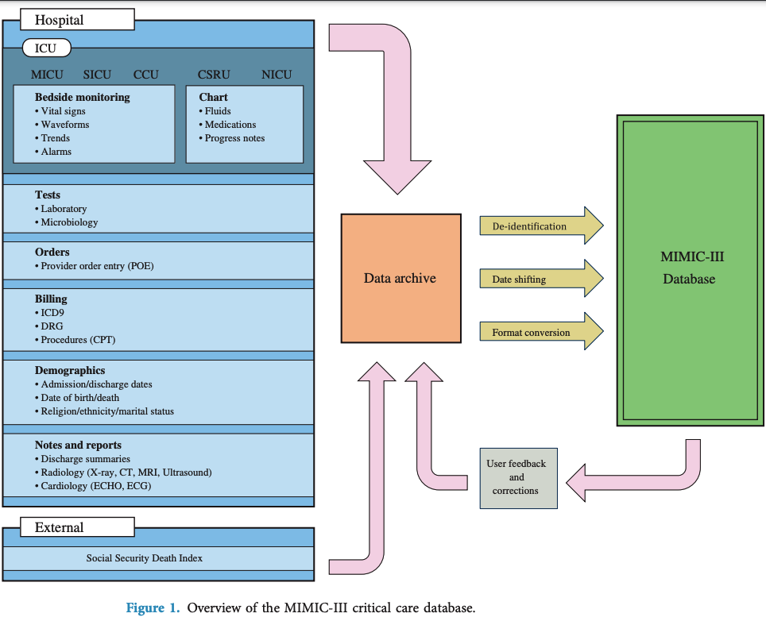

---
jupytext:
  text_representation:
    extension: .md
    format_name: myst
kernelspec:
  display_name: Clinical Data Models
  language: python
  name: python3
---

# MIMIC-III Data Models #

## Resources

[MIMIC-III Overview](https://d3c33hcgiwev3.cloudfront.net/BPhv1ArLEem6Pgo4-YwqLg_052af1500acb11e980d6e7465a739109_Data-Descriptor-MIMIC-III_-a-freely-accessible-critical-care-database.pdf?Expires=1602028800&Signature=M48DqhjyhvMWdteVnNlufTVbh~oOgTS10SJT3i33ua4jyCLLUAt2ZoCB7MrsaOqXFkS1ViZqgRS-qHkeBqPBSPP~bFfdxs9l16edjlvZcz7pHgXH4Sk1SW4kYpifbIW3x9qmGJxm2TvdyB-smMalOVNJZnsXusZhbRTuegkPzAg_&Key-Pair-Id=APKAJLTNE6QMUY6HBC5A)

[MIMIC-III Bigquery SQL Scripts](https://d3c33hcgiwev3.cloudfront.net/5iLW3wAFEemTKQ5ajE7PqA_e62f8060000511e9abba8fe04eb746ff_Module-2-SQL-statements.sql?Expires=1602028800&Signature=ShGVnuLTAO6qy0-127yr1zmfoYrBA1LpmQOSLOUaH3doXkDRYnEatGL~Y4xjj0y4Kwef2q0bMX7GEIKHzg5v2iXZ1GjbG5wgVQKkKmpYdFFHotcrxEaRebC6ZPFlweGxpbxO9XPAIdbl9QWA6nAqxDHb1EMty~vm3wb1biA2nS8_&Key-Pair-Id=APKAJLTNE6QMUY6HBC5A)

[OHDSI.org](https://ohdsi.org/)

## Week 2 - Tools: Querying Clinical Data Model

### MIMIC-III DEEP DIVE
- MiMIC - Medical Information Marked for Intensive Care
    - 11 year time frame (2001-2012)
    - subset free access (100 patients only)
    - data achiving method
        1. de-identification
        1. date shifting
            - original dates changed to future dates
        1. format conversion 

- Dataflow
     
- Schema
    
    
### OMOP DEEP DIVE
- Mission: Collaborative community and evidence-driven
- Vision: Observational research for understanding of health/disease
- Conceptual view of OMOP MODEL
    - 2 models
        1. Local (source)
        1. Network (standard)
- OMOP Computed Abstractions
    1. Observation Period
        - duration of patient under the care of provider or health plan
    1. Drug Era
        - drug exposures
    1. Condition Era
    1. Cohort
        - a group of patient with common set of characteristics
        
        
### OMOP vs MIMIC-III

| MIMIC | OMOP |
| --- | --- |
| Store diverse data and retain original format | Considers International data sharing from inception |
| single institution | international harmonization of terminology |
| maintains differences in underlying source data system | keeps original data but doesn't use it |
| ICU and Admission-centric | Wide-range of care environments
| data source are stored in sepearate tables (CareView vs MetaView System) | data from different sources combined into one table (medications from presribed, filled, administered tables are combined into drug_exposure table) |
| no computed abstractions | lots of computed abstractions | 
| Flat termininology structure | hierarchial sets | 
| optimize for data integrity | optimize to support multi-international institutions |
| transformation seeks zero information loss | transformation may lose data fidelity |
| harmonizatino done by data analyst | harmonization done by local data owners |